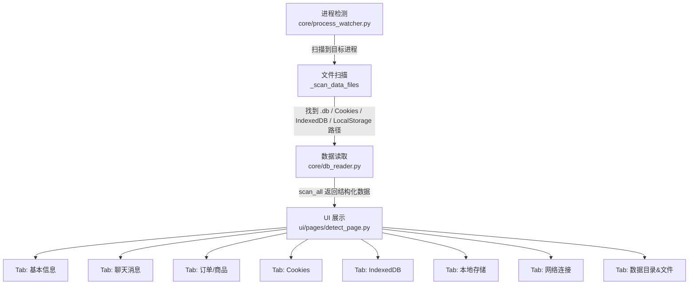

# 检测模块说明

本文档说明 AIKF 客服助手的进程检测、数据读取与可视化展示模块的整体架构与使用方法。

---

## 整体架构



---

## 各检测模块说明

| 模块 | 文件 | 说明 |
|------|------|------|
| 进程监控 | `core/process_watcher.py` | 扫描系统进程，识别拼多多/京东等客服软件，采集 PID、内存、网络连接、文件路径等基础信息 |
| 文件扫描 | `core/process_watcher.py` → `_scan_data_files()` | 在进程数据目录下递归查找 Cookies、.db/.sqlite、IndexedDB 目录、LocalStorage 目录等 |
| 数据库读取 | `core/db_reader.py` | 以只读模式打开 SQLite 文件，读取聊天记录、订单/商品信息、Cookies、LocalStorage 内容 |
| IndexedDB 统计 | `core/db_reader.py` → `extract_indexeddb_summary()` | 统计 IndexedDB 目录内 .ldb/.log/.idb 等文件数量与大小 |
| 可视化展示 | `ui/pages/detect_page.py` | 全面数据检测页面，分 8 个 Tab 展示所有检测结果 |
| 进程监控页 | `ui/pages/monitor_page.py` | 进程卡片列表与详情面板，深度扫描完成后弹出摘要对话框 |

---

## `core/db_reader.py` 函数说明

### `read_sqlite_safe(db_path, table_hint=None, limit=200)`

以只读方式打开 SQLite 文件，枚举所有表（或包含 `table_hint` 关键词的表），每表最多读取 `limit` 行。

**参数：**
- `db_path` (str)：SQLite 文件路径
- `table_hint` (str, 可选)：只读包含此关键词的表（不区分大小写）
- `limit` (int)：每张表最多读取的行数，默认 200

**返回：**
```python
{
    '表名1': [{'字段': '值', ...}, ...],
    '表名2': [...],
    # 失败时
    'error': '错误信息',
}
```

**示例：**
```python
from core.db_reader import read_sqlite_safe

data = read_sqlite_safe(r'C:\Users\Public\Documents\PDD\...\Msg.db')
for table, rows in data.items():
    print(f'{table}: {len(rows)} 行')
```

---

### `extract_chat_messages(data_dirs: list) -> list`

遍历 `data_dirs` 下所有 `Msg.db` / `chat.db` / `message.db` 文件，读取全部内容。

**返回：**
```python
[
    {
        'db_path': '/path/to/Msg.db',
        'table': 'message',
        'row': {'id': 1, 'content': '...', ...},
    },
    ...
]
```

---

### `extract_order_info(data_dirs: list) -> list`

遍历 `data_dirs` 下所有 `Info2.db` / `info.db` / `order.db` / `search.db` 文件，读取订单/商品相关数据。

**返回结构**同 `extract_chat_messages`。

---

### `extract_cookies(cookie_paths: list) -> list`

读取 Chromium/Electron 格式的 SQLite Cookies 文件。

**返回：**
```python
[
    {
        'host': '.taobao.com',
        'name': 'cookie_name',
        'value': 'cookie_value',
        'path': '/',
        'expires_utc': 13300000000000000,
        '_source': '/path/to/Cookies',
    },
    ...
]
```

---

### `extract_indexeddb_summary(indexeddb_dirs: list) -> dict`

统计 IndexedDB 目录内的文件数量与总大小。

**返回：**
```python
{
    'total_files': 42,
    'total_size_kb': 1024.5,
    'files': [
        {'path': '/path/to/000001.ldb', 'size_kb': 12.3},
        ...
    ],
}
```

---

### `extract_local_storage(local_storage_dirs: list) -> list`

读取 `.localstorage` 文件（SQLite `ItemTable` 格式）中的键值数据。

**返回：**
```python
[
    {
        'origin': 'https_seller.pdd.com_0',
        'key': 'userInfo',
        'value': '{"uid": 12345, ...}',
    },
    ...
]
```

---

### `scan_all(data_dirs, cookies_files, indexeddb_dirs, local_storage_dirs) -> dict`

一次性调用所有检测方法，返回完整汇总字典。

**参数：**
- `data_dirs` (list)：数据目录列表
- `cookies_files` (list)：Cookies 文件路径列表
- `indexeddb_dirs` (list)：IndexedDB 目录列表
- `local_storage_dirs` (list)：LocalStorage 目录列表

**返回：**
```python
{
    'chat_messages': [...],
    'order_info': [...],
    'cookies': [...],
    'indexeddb': {'total_files': 10, 'total_size_kb': 256.0, 'files': [...]},
    'local_storage': [...],
    'scan_time': '2026-03-28 12:00:00',
    'data_dirs': [...],
}
```

**示例：**
```python
from core.db_reader import scan_all

result = scan_all(
    data_dirs=[r'C:\Users\Public\Documents\PDD'],
    cookies_files=[r'C:\Users\Public\Documents\PDD\...\Cookies'],
    indexeddb_dirs=[r'C:\Users\Public\Documents\PDD\...\IndexedDB'],
    local_storage_dirs=[r'C:\Users\Public\Documents\PDD\...\Local Storage'],
)
print(f"聊天记录: {len(result['chat_messages'])} 条")
print(f"Cookies: {len(result['cookies'])} 条")
```

---

## `DetectPage` 各 Tab 说明

| Tab | 数据来源 | 说明 |
|-----|----------|------|
| 📋 基本信息 | `get_process_detail()` 直接返回 | 进程名、PID、平台、状态、路径、内存、CPU、启动时间、店铺名、命令行、子进程、调试端口、Token 数、环境变量 |
| 💬 聊天消息 | `scan_all_data.chat_messages` | 来自 Msg.db/chat.db 的聊天记录，双击行展开完整 JSON |
| 📦 订单/商品 | `scan_all_data.order_info` | 来自 Info2.db/search.db 的订单商品数据，双击行展开完整 JSON |
| 🍪 Cookies | `scan_all_data.cookies` | 来自 Cookies 文件，支持「导出 CSV」 |
| 🗄️ IndexedDB | `scan_all_data.indexeddb` | 统计 .ldb/.log/.idb 等文件数量与大小 |
| 📁 本地存储 | `scan_all_data.local_storage` | 来自 .localstorage 文件的键值对 |
| 🌐 网络连接 | `all_connections` | 全部 TCP 连接，WS 候选（443/80/8080 端口 ESTABLISHED）用红色高亮 |
| 📂 数据目录&文件 | `local_data_dirs` + `data_files` | 数据目录列表（上半区）+ 各类文件按颜色分类（下半区） |

---

## 已知限制

1. **需要管理员权限**：在 Windows 上读取某些进程的打开文件列表、环境变量、命令行参数需要以管理员身份运行程序。
2. **Cookies 加密**：新版 Chromium（M127+）的 Cookies `value` 字段可能已被 App-Bound Encryption 加密（以 `v20` 开头），直接读取会得到密文。
3. **WAL 模式 .db 文件**：若进程正在写入数据库（.db-wal 文件存在），只读模式读取可能得到不完整数据。
4. **IndexedDB LevelDB 格式**：.ldb 文件是 LevelDB 二进制格式，当前模块只统计文件数量与大小，未解析实际内容。
5. **Linux/macOS 支持有限**：窗口标题获取（ctypes winuser）仅在 Windows 上有效；数据目录路径匹配也以 Windows 路径为主。

---

## 后续扩展建议

1. **CDP 网络拦截**：若进程以 `--remote-debugging-port=端口` 启动，可通过 Chrome DevTools Protocol (CDP) 实时拦截所有 API 请求/响应，获取动态数据。参考：`core/cdp_interceptor.py`（待实现）。
2. **Cookies 解密**：集成 `pycryptodome` 和 Windows DPAPI 解密 v10 格式 Cookies；或监听系统注册表获取 App-Bound Encryption 密钥。
3. **IndexedDB 内容解析**：集成 `leveldb` Python 库，解析 .ldb 文件中的实际 K-V 内容。
4. **实时监听**：使用 `watchdog` 库监听数据目录文件变化，在有新数据写入时自动触发增量检测。
5. **AI 客服数据接入**：将 `scan_all_data` 结构化数据直接传给 AI 客服模块（`ui/pages/ai_page.py`），实现上下文感知的智能回复建议。
